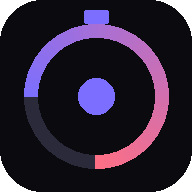

# ОДИН·ДВА — Interval Timer PWA

Прогрессивное веб-приложение для интервальных тренировок. Работает офлайн, устанавливается на главный экран телефона.



## Возможности

- **Создание тренировок** — название, иконка, список упражнений, настройка таймингов (работа / отдых / заминка)
- **Таймер с визуализацией** — круговой прогресс-бар, подсветка фаз, обратный отсчёт 3-2-1
- **Музыка по фазам** — отдельный трек для фазы «Работа», «Отдых» и «Заминка»; хранится локально через IndexedDB
- **Звуковые сигналы** — Web Audio API без зависимостей
- **Прогресс** — история тренировок с возможностью удаления записей, прокрутка внутри блока
- **Адаптивный дизайн** — mobile-first, на десктопе ограничена шириной 480 px с тенью
- **PWA** — офлайн через Service Worker, иконки 192/512/180 px, fullscreen

## Стек

| Слой | Технологии |
|------|-----------|
| UI | Vanilla HTML / CSS (Custom Properties, Flexbox, CSS Animations) |
| Логика | Vanilla JavaScript (ES2020+) |
| Хранилище тренировок | `localStorage` |
| Хранилище музыки | `IndexedDB` (база `odindva_music`) |
| Звук | `Web Audio API` |
| Офлайн | `Service Worker` (cache-first) |
| Манифест | `manifest.json` (fullscreen, portrait) |

## Структура

```
1-2/
├── index.html        # Разметка (5 экранов + bottom sheet + диалог подтверждения)
├── style.css         # Все стили, CSS-переменные, анимации
├── app.js            # Полная логика приложения
├── sw.js             # Service Worker
├── manifest.json     # PWA-манифест
├── favicon.svg       # Векторная иконка (прозрачный фон)
├── favicon-32.png    # Растровый фолбэк
└── icons/
    ├── icon-180.png  # Apple Touch Icon
    ├── icon-192.png  # PWA icon
    └── icon-512.png  # PWA icon (maskable)
```

## Запуск локально

```bash
# Необходим HTTP-сервер (не file://)
python3 -m http.server 8080
# открыть http://localhost:8080
```

## Экраны

1. **Главная** — список тренировок + блок прогресса с историей
2. **Детали** — параметры тренировки, кнопка «Старт», меню редактирования/удаления
3. **Создание** — форма с упражнениями, таймингами, выбором музыки на каждую фазу
4. **Таймер** — анимированный круговой таймер, пауза по тапу, индикатор подходов
5. **Результаты** — конфетти, статистика сессии, лог по упражнениям

## Удаление данных

Все удаления (тренировка, запись прогресса) требуют подтверждения через встроенный диалог.

---

*odin-dva.ru*
